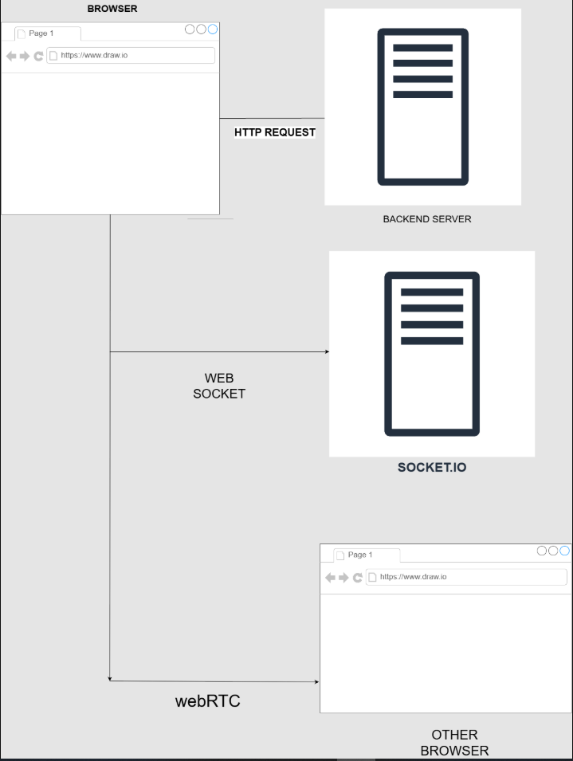

# Locked In

Locked In is a real time room based application , where users join timed room sessions, communicate via voice and chat optionally share their screen , to build something and ship under the time constraint.

## High Level Architecture Overview

- The frontend runs in browser,rendering UI,media capture ,and webRTC peer connection.
- The backend handles the authentication and REST API'S.
- The socket.io handles the signalling for room co-ordination , persistent connection , acting as a middle man between peer to peer for webRTC negotiation.
- Media flows directly between browser <-> browser , no server inbetween .

## Core Features
- **Timed Rooms** : Sessions run with timed room , which enforces accountability and pressure.
- **Real time voice & chat** : Users can communicate using voice and chat at real time which improves the productivity.
- **Screen Sharing** : Users can make use of the screen sharing feature which was built using webRTC.
- **Submission-flow** : Users can submit their work once the timer ends , integerated AI will provide users with summary of what could be improved and how good their work is .

## Technical design & Decisions
### Real time room coordination

  
